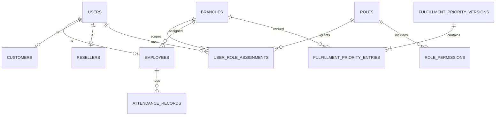
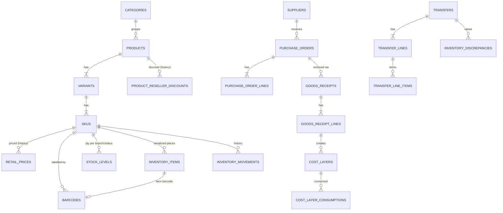
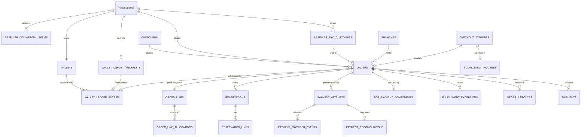
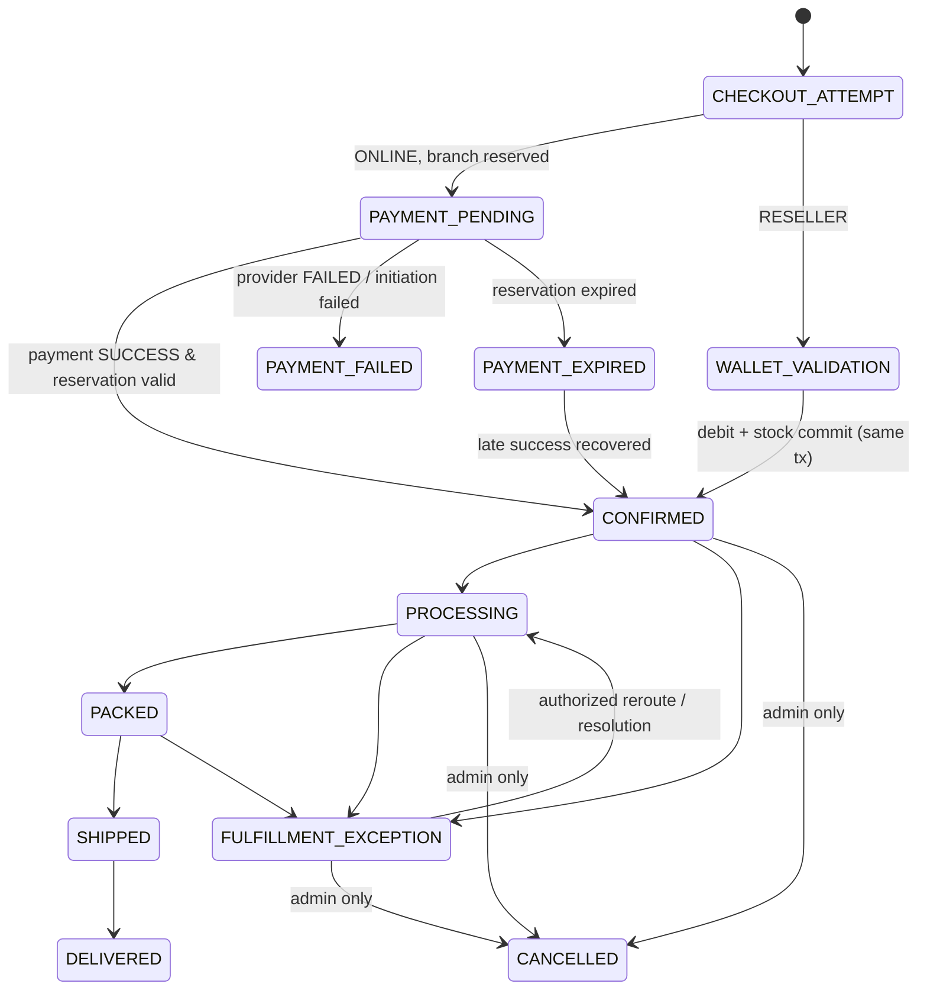
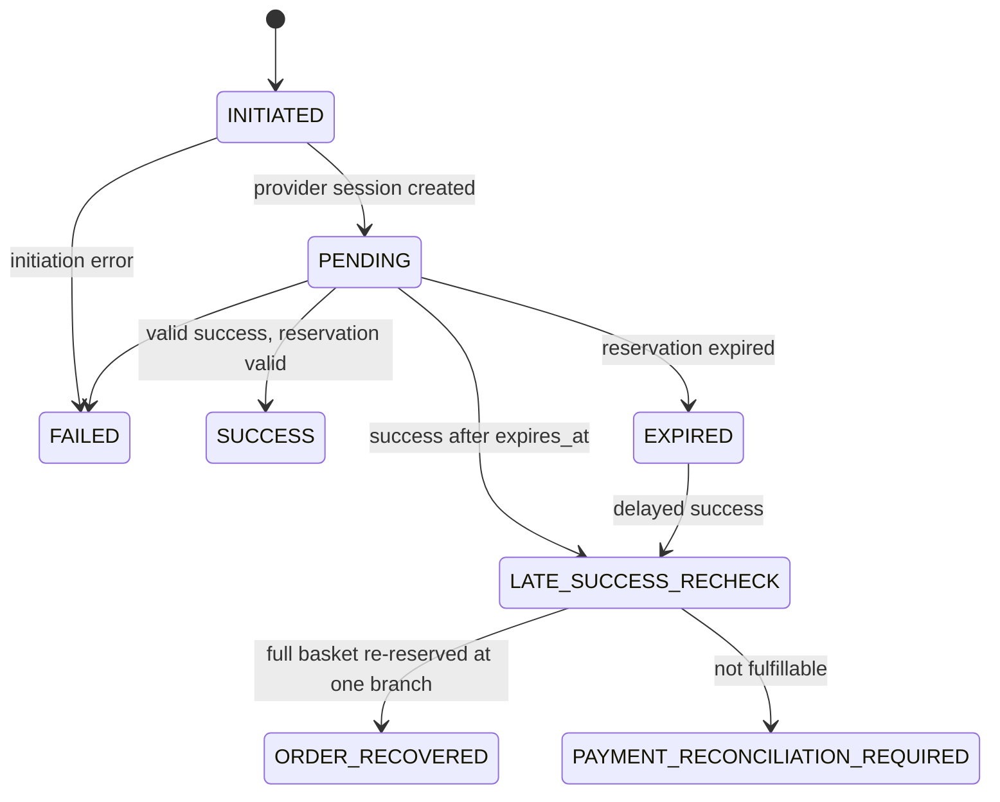
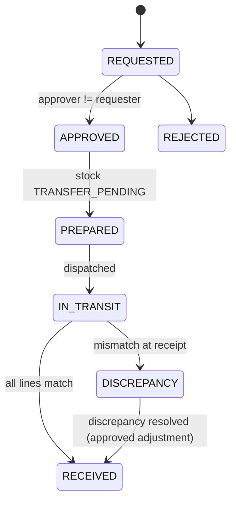

# Manoksha Collections V1 — Architecture & Technical Design

| | |
|---|---|
| Status | **APPROVED** (24 Sep 2026). Open questions in §23 are answered in [ADR-001](ADR-001-V1-Owner-Clarifications.md), which takes precedence over this document. |
| Business source of truth | *Manoksha Collections V1 Final Implementation Requirements & Architecture Specification* (finalized 24 Sep 2026), referenced below as **SPEC §n** |
| Scope of this document | Technical design only. It does not add, remove or reinterpret business rules. Anything that would require a business decision is listed in §23 (Open Questions) rather than decided here. |

---

## 0. Guiding decisions (summary)

1. **One backend** (`manoksha-backend`, .NET 8 modular monolith), **one PostgreSQL database** (Cloud SQL), used by every client.
2. **Four client/app workspaces**: backend, admin web, customer web (hosting the separated reseller area), Flutter POS.
3. **One EF Core `DbContext`, one database, one PostgreSQL schema per module.** This is what makes the cross-module atomic operations in SPEC §32 (wallet debit + inventory commit + order creation) a single real database transaction instead of a distributed saga.
4. **Correctness is enforced in the database, not only in code**: conditional updates / row locks for inventory, `SELECT … FOR UPDATE` + `CHECK (balance >= 0)` for wallets, unique constraints for every idempotency key, append-only triggers for audit and ledger tables.
5. **Background jobs never own correctness.** For example, a reservation is invalid the instant `now() > expires_at` whether or not the expiry sweeper has run.
6. **Business events → transactional outbox → notifications.** A notification failure can never roll back a business transaction (SPEC §29).
7. **Clients are untrusted.** Prices, totals, branch, reseller identity and permissions are always derived server-side.

---

## 1. Workspace / repository structure

Recommended: **one Git monorepo** with the four application workspaces as top-level folders (independently built and deployed), plus shared contracts and infrastructure. A monorepo keeps the OpenAPI contract, generated clients and the backend in lock-step, which matters because the frontends must never re-implement business rules. (If you prefer four separate repos, the structure below splits cleanly — see Q1 in §23.)

```
manoksha/                              ← repo root
├── manoksha-backend/                  .NET 8 modular monolith (API + Worker)
├── manoksha-admin-web/                Next.js + TS + Tailwind — internal users (Owner, managers, employees)
├── manoksha-customer-web/             Next.js + TS + Tailwind — public storefront + separated /reseller area
├── manoksha-mobile-pos/               Flutter — POS, scanning, counts, receiving, transfers, attendance
├── packages/                          (pnpm workspace, web only — NOT applications)
│   ├── api-client/                    TS client generated from backend OpenAPI (no business logic)
│   └── ui/                            shared Tailwind components/tokens (optional)
├── contracts/
│   └── openapi/manoksha-v1.json       committed OpenAPI snapshot; CI fails if it drifts from backend
├── infra/
│   ├── terraform/                     GCP projects, Cloud Run, Cloud SQL, Secret Manager, GCS, LB, Armor
│   └── docker-compose.local.yml       Postgres, Mailpit, fake-gcs, payment/SMS simulators
├── docs/
│   ├── architecture/                  this document, ADRs
│   └── runbooks/                      reconciliation, incident, deploy runbooks (Phase 10)
└── .github/workflows/                 per-workspace CI (path-filtered) + deploy pipelines
```

Reseller experience: implemented inside `manoksha-customer-web` as a **separate route group `/reseller/*`** with its own login page, its own token audience (`reseller`), its own layout and navigation. It shares catalog/cart UI components with the storefront but never shares a session with a customer. The backend rejects a customer token on reseller endpoints and vice-versa, so the UI separation is not the security boundary. It can be extracted into its own Next.js app later with no backend change.

---

## 2. Backend solution structure

```
manoksha-backend/
├── Manoksha.sln
├── Directory.Build.props             nullable, warnings-as-errors, analyzers, central package mgmt
├── src/
│   ├── Hosts/
│   │   ├── Manoksha.Api/             ASP.NET Core Web API host: endpoint mapping, authN/authZ,
│   │   │                             ProblemDetails, rate limiting, OpenAPI, health checks
│   │   └── Manoksha.Worker/          Worker host: outbox dispatcher, reservation expiry,
│   │                                 payment status poller, integrity checks
│   ├── BuildingBlocks/
│   │   ├── Manoksha.SharedKernel/    Entity/AggregateRoot base, Money (INR), strongly-typed IDs,
│   │   │                             Result/Error, IClock, domain events, guard clauses
│   │   ├── Manoksha.Application/     ICurrentUser, IPermissionService, IBranchScope, IAuditWriter,
│   │   │                             IIdempotencyStore, IOutbox, IUnitOfWork, pipeline behaviours
│   │   └── Manoksha.Persistence/     ManokshaDbContext, module model registration, outbox,
│   │                                 idempotency, audit interceptor, number sequences,
│   │                                 append-only trigger helpers, EF conventions (snake_case, UTC)
│   ├── Modules/                      one project per bounded module (see §3)
│   │   ├── Manoksha.Modules.Identity/
│   │   ├── Manoksha.Modules.Branches/
│   │   ├── Manoksha.Modules.Employees/          (includes Attendance)
│   │   ├── Manoksha.Modules.Catalog/            (includes Barcode)
│   │   ├── Manoksha.Modules.Inventory/          (includes Transfers, Counts, FIFO cost layers)
│   │   ├── Manoksha.Modules.Purchasing/         (includes Suppliers)
│   │   ├── Manoksha.Modules.Pricing/
│   │   ├── Manoksha.Modules.Customers/
│   │   ├── Manoksha.Modules.Resellers/
│   │   ├── Manoksha.Modules.Wallet/
│   │   ├── Manoksha.Modules.Orders/             (includes Cart, Checkout, POS sale)
│   │   ├── Manoksha.Modules.Payments/           (includes Reconciliation)
│   │   ├── Manoksha.Modules.Fulfillment/        (routing, reservations, exceptions, reroute, shipping)
│   │   ├── Manoksha.Modules.Approvals/
│   │   ├── Manoksha.Modules.Notifications/
│   │   ├── Manoksha.Modules.Audit/
│   │   ├── Manoksha.Modules.Exceptions/         (Owner Exception Center work queue)
│   │   ├── Manoksha.Modules.Settings/
│   │   └── Manoksha.Modules.Reporting/          (read-only queries)
│   ├── Integrations/
│   │   ├── Manoksha.Integrations.Sms/           ISmsSender: provider adapter + local fake
│   │   ├── Manoksha.Integrations.Email/         IEmailSender: provider adapter + Mailpit/local
│   │   ├── Manoksha.Integrations.PaymentGateway/ IPaymentGateway: UPI provider adapter + simulator
│   │   ├── Manoksha.Integrations.Storage/       IFileStorage: GCS + local
│   │   └── Manoksha.Integrations.Pdf/           commercial-term PDFs, receipts
│   └── Migrations/
│       └── Manoksha.Migrations/                 EF Core migrations + migration runner (Cloud Run Job)
└── tests/
    ├── Manoksha.UnitTests/                      domain rules (pricing, state machines, FIFO)
    ├── Manoksha.IntegrationTests/               real PostgreSQL via Testcontainers; API-level tests
    ├── Manoksha.ConcurrencyTests/               parallel races (last item, wallet, webhooks)
    └── Manoksha.ArchitectureTests/              module-boundary rules (NetArchTest)
```

**Inside each module project**

```
Manoksha.Modules.Wallet/
├── Contracts/        PUBLIC: interfaces + DTOs other modules may call (e.g. IWalletService.DebitForOrder)
├── Domain/           internal: entities, value objects, state machines, domain events
├── Application/      internal: commands/queries + handlers, validators, authorization checks
├── Persistence/      internal: EF entity configurations (schema "wallet"), queries
├── Endpoints/        internal: minimal-API route groups per audience (admin/reseller/…)
└── WalletModule.cs   registration: services, endpoints, model configuration
```

- API style: ASP.NET Core **Minimal APIs with route groups** per module and audience, FluentValidation, RFC 7807 ProblemDetails errors with stable error codes (e.g. `WALLET_INSUFFICIENT_BALANCE`).
- In-process command/query dispatch (thin mediator). No message broker.
- OpenAPI generated from the API; TS client (`openapi-typescript`) and Dart client (`openapi-generator`) are generated from it.

---

## 3. Module boundaries

| Module | Owns (tables in its schema) | Public contract used by others |
|---|---|---|
| **Identity** | users, credentials, OTP challenges, sessions/refresh tokens, roles, permissions, role assignments, MFA | `ICurrentUser`, `IPermissionService`, `IBranchScope`, create/lock identities |
| **Branches** | branches, fulfillment priority versions/entries | active branches, current priority list |
| **Employees** | employees, branch assignment history, attendance records | employee ↔ user ↔ assigned branch |
| **Catalog** | categories, attribute definitions/options, products, variants, SKUs, images, barcodes, barcode print log | SKU lookup, barcode resolve, tracking mode |
| **Purchasing** | suppliers, purchase orders, goods receipts (+ lines) | — (calls Inventory to create stock & cost layers) |
| **Inventory** | stock levels (quantity), inventory items (serialized), cost layers & consumptions, movements, transfers, stock counts, adjustments, inventory discrepancies | reserve/release/consume/commit stock, availability by branch, FIFO consumption |
| **Pricing** | retail price history, product reseller discount history | `IPriceCalculator` (retail, reseller, POS base price) |
| **Customers** | customers, addresses, reseller end-customers | customer lookups (scoped) |
| **Resellers** | resellers, status history, commercial-term versions | reseller status/eligibility, current discount term |
| **Wallet** | wallets, ledger entries, deposit requests | `DebitForOrder`, `Reverse`, `Credit` (atomic within caller's tx) |
| **Orders** | carts, checkout attempts, orders, order lines (price snapshots), status history, POS price overrides | order creation/transitions |
| **Payments** | payment attempts, provider events (webhook inbox), POS payment components, reconciliation cases | initiate payment, process provider event |
| **Fulfillment** | reservations (+ lines), branch evaluations, fulfillment inquiries, fulfillment exceptions, reroutes, shipments | `IBranchResolver`, reserve basket, reroute |
| **Approvals** | approval policies (thresholds), approval requests/decisions | request/decide approval; separation-of-duty check |
| **Notifications** | notifications, in-app inbox, delivery attempts, templates | publish via outbox; WhatsApp deep-link builder |
| **Audit** | audit log (append-only) | `IAuditWriter` (same transaction) |
| **Exceptions** | exception cases (work-queue index over domain records) | open/resolve case |
| **Settings** | system settings (versioned) | typed settings (reservation minutes, thresholds, WhatsApp number, shipping fee) |
| **Reporting** | read models / materialized summaries only | — |

**Boundary rules (enforced by `ArchitectureTests`)**
- A module may reference another module's **`Contracts` namespace only**, never its Domain/Persistence.
- A module's EF configuration only maps tables in its own schema.
- All modules share the request-scoped `ManokshaDbContext`, so a call like `IWalletService.DebitForOrder` made from Orders participates in the caller's transaction.
- Reporting may read across schemas (read-only, via SQL views/queries) — it never writes.

---

## 4. Database entities

Conventions: PostgreSQL 16; `snake_case`; all PKs `uuid` (UUIDv7, server-generated, time-ordered); money `numeric(14,2)` INR; percentages `numeric(5,2)`; timestamps `timestamptz` stored in UTC (displayed IST); human-readable numbers (order no., reseller no., reference no.) from PostgreSQL sequences, unique-indexed, never PKs; mobile stored normalized E.164 (`+91XXXXXXXXXX`); email stored with a lower-cased normalized column. Soft status instead of hard delete for all business records. Optimistic concurrency via PostgreSQL `xmin` on mutable aggregates.

### 4.1 identity
- `users` — id, account_type (`INTERNAL|CUSTOMER|RESELLER`), status (`PENDING|ACTIVE|LOCKED|DISABLED`), display_name, email, email_normalized, mobile_e164, mobile_verified_at, password_hash (internal only), mfa_enabled, mfa_secret_encrypted, security_stamp, last_login_at, created_at, created_by
  - unique `(account_type, mobile_e164)` where mobile not null; unique `(account_type, email_normalized)` for INTERNAL (see Q2)
- `otp_challenges` — id, mobile_e164, purpose (`LOGIN|REGISTER|RESELLER_ACTIVATION`), code_hash, expires_at, attempts, consumed_at, ip, created_at
- `refresh_sessions` — id, user_id, token_hash, audience, device_info, created_at, expires_at, revoked_at, replaced_by
- `roles` — id, code, name, is_system, is_active
- `permissions` — code (e.g. `inventory.transfer.approve`), module, description, is_sensitive
- `role_permissions` — role_id, permission_code
- `user_role_assignments` — id, user_id, role_id, branch_id (null = global), assigned_by, assigned_at, revoked_at

### 4.2 branches
- `branches` — id, code, name, address, city, state, pin, phone, is_active, created_at
- `fulfillment_priority_versions` — id, version_no, created_by, created_at, reason
- `fulfillment_priority_entries` — version_id, branch_id, priority (unique per version)

### 4.3 employees
- `employees` — id, user_id (unique), employee_code, full_name, mobile, assigned_branch_id, status, joined_on
- `employee_branch_assignments` — id, employee_id, branch_id, from_at, to_at, assigned_by, reason
- `attendance_records` — id, employee_id, branch_id (from assignment, never client-chosen), clock_in_at, clock_out_at, clock_in_source, notes, corrected_by, correction_reason

### 4.4 catalog
- `categories` — id, parent_id, name, slug, sort_order, is_active
- `attribute_definitions` — id, code, name, data_type (`OPTION|TEXT|NUMBER`), is_active
- `attribute_options` — id, attribute_id, value, sort_order
- `products` — id, category_id, name, slug, description, tracking_mode (`SERIALIZED|QUANTITY`), status (`DRAFT|ACTIVE|INACTIVE`), is_online_visible, created_at
- `product_variant_attributes` — product_id, attribute_id (which attributes define variants for this product)
- `variants` — id, product_id, name, status
- `variant_attribute_values` — variant_id, attribute_id, option_id / value
- `skus` — id, variant_id, sku_code (unique), status
- `product_images` — id, product_id, variant_id?, storage_key, sort_order
- `barcodes` — id, code (unique), sku_id, inventory_item_id (nullable; set for serialized), status, created_at
- `barcode_print_log` — id, barcode_id, printed_by, printed_at, is_reprint (reprint never creates a new barcode/identity)

### 4.5 purchasing
- `suppliers` — id, name, contact, mobile, email, gstin (attribute only), address, is_active
- `purchase_orders` — id, po_number, supplier_id, status (`DRAFT|ISSUED|PARTIALLY_RECEIVED|RECEIVED|CLOSED|CANCELLED`), ordered_at, created_by, notes
- `purchase_order_lines` — id, po_id, sku_id, ordered_qty, expected_unit_cost
- `goods_receipts` — id, gr_number, po_id, supplier_invoice_ref, received_at, receiving_branch_id, received_by, status
- `goods_receipt_lines` — id, gr_id, po_line_id, sku_id, received_qty, damaged_qty, accepted_qty, actual_unit_cost, destination_branch_id

### 4.6 inventory
- `stock_levels` (QUANTITY-tracked SKUs) — sku_id, branch_id, status, quantity, `CHECK (quantity >= 0)`; PK (sku_id, branch_id, status)
- `inventory_items` (SERIALIZED SKUs) — id, sku_id, branch_id, status, cost_layer_id, current_reservation_id, current_order_line_id, received_at; partial index `(sku_id, branch_id) WHERE status='AVAILABLE'`
- `cost_layers` — id, sku_id, branch_id, source_type (`GOODS_RECEIPT|TRANSFER_IN`), source_id, layer_date, unit_cost, original_qty, remaining_qty `CHECK (remaining_qty >= 0)`
- `cost_layer_consumptions` — id, cost_layer_id, order_line_id / transfer_line_id, qty, unit_cost, consumed_at (append-only; basis of FIFO gross profit)
- `inventory_movements` (append-only) — id, sku_id, inventory_item_id?, qty, from_branch_id, to_branch_id, from_status, to_status, movement_type, reference_type, reference_id, actor_user_id, reason, occurred_at
- `transfers` — id, transfer_number, source_branch_id, destination_branch_id, status, requested_by/at, approved_by/at, prepared_by/at, dispatched_by/at, received_by/at, notes
- `transfer_lines` — id, transfer_id, sku_id, requested_qty, dispatched_qty, received_qty
- `transfer_line_items` — transfer_line_id, inventory_item_id, dispatched, received
- `stock_counts` / `stock_count_lines` — branch, counted_by, sku, item, system_qty, counted_qty
- `inventory_adjustments` — id, branch_id, sku_id, item_id?, qty_delta, from/to status, reason_code, requested_by, approval_request_id, status
- `inventory_discrepancies` — id, source_type (`TRANSFER|COUNT|FULFILLMENT_EXCEPTION`), source_id, branch_id, sku_id, expected_qty, actual_qty, status, resolution, resolved_by/at

### 4.7 pricing
- `retail_prices` — id, sku_id, price, effective_from, effective_to, set_by, reason (history; one open row per SKU)
- `product_reseller_discounts` — id, product_id, discount_pct, effective_from, effective_to, set_by, reason (absence of an open row = not configured)

### 4.8 customers
- `customers` — id, user_id (nullable), customer_number, full_name, mobile_e164, email, status, created_at
- `customer_addresses` — id, customer_id, name, mobile, line1, line2, city, state, pin, is_default
- `reseller_end_customers` — id, reseller_id, full_name, mobile_e164, email, address fields, created_at (always reseller-scoped; see Q5)

### 4.9 resellers
- `resellers` — id, reseller_number, user_id, contact_name, business_name, mobile_e164, email, address, city, state, pin, status, notes, created_by, activated_at
- `reseller_status_history` — id, reseller_id, from_status, to_status, actor, reason, at
- `reseller_commercial_terms` — id, reseller_id, version_no, reseller_discount_pct, notes, effective_from, created_by, pdf_file_id (one current version; earlier versions immutable)

### 4.10 wallet
- `wallets` — id, reseller_id (unique), balance `CHECK (balance >= 0)`, updated_at, xmin
- `wallet_ledger_entries` (append-only) — id, wallet_id, reseller_id, type (`DEPOSIT|DEBIT|REVERSAL|ADJUSTMENT`), direction (`CREDIT|DEBIT`), amount `CHECK (amount > 0)`, balance_before, balance_after, order_id?, deposit_request_id? (**unique**), reverses_entry_id? (**unique**), reason, created_by, created_at, approval_request_id?, idempotency_key (**unique**)
- `wallet_deposit_requests` — id, deposit_number, reseller_id, method (`PROVIDER_ONLINE|DIRECT_PROOF`), amount, external_reference, proof_file_ids, status (`PENDING|APPROVED|CREDITED|REJECTED`), submitted_at, reviewed_by, reviewed_at, rejection_reason, payment_attempt_id?

### 4.11 orders
- `carts` / `cart_items` — owner (customer or reseller user), sku_id, qty (prices never stored as authoritative)
- `checkout_attempts` — id, idempotency_key (unique per user), channel, buyer refs, cart_snapshot jsonb, outcome (`RESERVED|NO_BRANCH|FAILED`), order_id?, inquiry_id?, created_at
- `orders` — id, order_number, channel (`ONLINE|STORE|RESELLER`), status, customer_id?, reseller_id?, reseller_end_customer_id?, fulfillment_branch_id, placed_by_user_id, merchandise_total, shipping_fee, grand_total, ship_to snapshot (jsonb), created_at, confirmed_at, xmin
- `order_lines` — id, order_id, sku_id, product/variant name snapshot, qty, retail_unit_price, discount_source (`NONE|RESELLER|PRODUCT_RESELLER|POS_NEGOTIATED`), discount_pct, discount_amount, final_unit_price, line_total, commercial_term_id?, product_discount_id? — **immutable after creation**
- `order_line_allocations` — order_line_id, inventory_item_id? / qty, branch_id, reservation_line_id
- `order_status_history` — order_id, from, to, actor, reason, at
- `pos_price_overrides` — id, order_line_id, original_price, final_price, discount_amount, discount_pct, reason, employee_id, approved_by?, approval_request_id?, branch_id, at

### 4.12 payments
- `payment_attempts` — id, order_id, provider, purpose (`ORDER|WALLET_DEPOSIT`), amount, status, provider_order_ref (unique), provider_payment_ref (unique, nullable), idempotency_key (unique), initiated_at, expires_at, completed_at, xmin; partial unique index: one non-terminal attempt per order
- `payment_provider_events` (webhook inbox) — id, provider, provider_event_id (**unique with provider**), payment_attempt_id?, event_type, payload jsonb, signature_valid, received_at, processed_at, processing_result
- `pos_payment_components` — id, order_id, method (`CASH|UPI_MANUAL|CARD|OTHER` — extensible lookup), amount, reference, recorded_by
- `payment_reconciliations` — id, case_number, payment_attempt_id (unique), provider_ref, amount, customer_id, order_id, reason_code, status (`OPEN|REFUND_INITIATED|REFUND_COMPLETED|RESOLVED`), owner_action, external_refund_ref, notes, created_at; + `payment_reconciliation_history`

### 4.13 fulfillment
- `reservations` — id, order_id, branch_id, status (`ACTIVE|CONSUMED|EXPIRED|RELEASED`), expires_at (copied from setting at creation), created_at, closed_at, close_reason
- `reservation_lines` — id, reservation_id, sku_id, qty, inventory_item_id?
- `branch_evaluations` — id, checkout_attempt_id / order_id, branch_id, priority, priority_version_id, result, shortfall jsonb, evaluated_at
- `fulfillment_inquiries` — id, reference (`MC-FUL-XXXXXXXX`), checkout_attempt_id, customer/reseller contact, cart snapshot, failure_reason, status, notes
- `fulfillment_exceptions` — id, order_id, branch_id, sku_id, reason (`ITEM_NOT_FOUND|DAMAGED|INVENTORY_MISMATCH|OTHER`), notes, raised_by/at, status, resolution
- `order_reroutes` — id, order_id, from_branch_id, to_branch_id, reason, fulfillment_exception_id, actor, at, inventory_effects jsonb
- `shipments` — id, order_id, courier, tracking_number, packed_by/at, shipped_by/at, delivered_at

### 4.14 approvals, settings, notifications, audit, exceptions, platform
- `approval_policies` — operation_type, threshold_type (`AMOUNT|PERCENT|QTY|VALUE`), threshold_value, required_permission, version
- `approval_requests` — id, operation_type, subject_type, subject_id, payload jsonb, requested_by, branch_id, status (`PENDING|APPROVED|REJECTED|CANCELLED`), decided_by, decided_at, reason, xmin
- `system_settings` — key, value jsonb, version, updated_by, updated_at (+ history)
- `notifications` — id, event_type, category (`CRITICAL|WARNING|INFO`), recipient_user_id / address, channel (`IN_APP|EMAIL|SMS`), template, payload, status (`PENDING|SENT|FAILED`), attempts, next_attempt_at, last_error
- `audit_log` (append-only) — id, occurred_at, actor_user_id, actor_roles, actor_branch_id, action, entity_type, entity_id, before jsonb, after jsonb, reason, ip, user_agent, correlation_id, prev_hash, hash
- `exception_cases` — id, type, severity, reference, source_type, source_id (unique pair), branch_id, status (`OPEN|IN_PROGRESS|RESOLVED`), assigned_to, opened_at, resolved_by/at, resolution_notes
- `outbox_messages` — id, type, payload, occurred_at, processed_at, attempts, error
- `idempotency_records` — scope, key, user_id, request_hash, status, response_code, response_body, created_at, expires_at; PK (scope, user_id, key)
- `stored_files` — id, bucket, object_key, content_type, size, sha256, purpose, uploaded_by, uploaded_at

---

## 5. Entity relationships (key)

- User 1–0..1 Employee; User 1–0..1 Customer; User 1–0..1 Reseller. (Account type decides which.)
- Employee *–1 Branch (assigned); Employee 1–* AttendanceRecord.
- Category 1–* Product 1–* Variant 1–* SKU; SKU 1–* Barcode; serialized InventoryItem 1–1 Barcode.
- Supplier 1–* PurchaseOrder 1–* POLine; PurchaseOrder 1–* GoodsReceipt 1–* GRLine → creates StockLevel qty / InventoryItems + CostLayer.
- SKU × Branch → StockLevel rows (per status) or InventoryItems; CostLayer *–1 SKU, *–1 Branch.
- Transfer *–1 source Branch, *–1 destination Branch; Transfer 1–* TransferLine 1–* TransferLineItem.
- Reseller 1–1 Wallet 1–* LedgerEntry; Reseller 1–* CommercialTerm; Reseller 1–* DepositRequest 0..1–1 LedgerEntry; Reseller 1–* ResellerEndCustomer.
- Order *–1 Branch (fulfillment); Order 1–* OrderLine 1–* Allocation; Order 1–* Reservation (history across reroute/recovery); Order 1–* PaymentAttempt (ONLINE) or 1–* PosPaymentComponent (STORE) or 1–1 LedgerEntry DEBIT (RESELLER).
- PaymentAttempt 1–* ProviderEvent; PaymentAttempt 0..1–1 PaymentReconciliation.
- Order 1–* FulfillmentException; Order 1–* OrderReroute.
- ExceptionCase → (source_type, source_id) of any exception-bearing record.

## 6. ER diagram

Split by area for readability.







---

## 7. State machines

All transitions go through a single domain method per aggregate that validates the transition, writes status history, writes audit (where SPEC §30 requires) and emits an outbox event. Illegal transitions throw and are never persisted.

### 7.1 Order (SPEC §27.1)

Notes: `WALLET_VALIDATION` never persists as a committed state — insufficient balance rolls the whole transaction back and no order row survives (SPEC §16, §33). `PAYMENT_FAILED`/`PAYMENT_EXPIRED` are technical terminal states for the attempt (not a customer "order" in history). STORE/POS sales are created directly in a terminal `COMPLETED` state within the finalize transaction (see Q9). No customer-facing cancel transition exists anywhere in the API.

### 7.2 Payment (SPEC §27.2)

`SUCCESS`, `ORDER_RECOVERED`, `PAYMENT_RECONCILIATION_REQUIRED` are sinks for provider events: duplicate/late events after these are recorded in the inbox and ignored.

### 7.3 Reservation (SPEC §27.3)
`ACTIVE → CONSUMED` (order confirmed) · `ACTIVE → EXPIRED` (now > expires_at) · `ACTIVE → RELEASED` (payment failed / reroute / admin cancel).

### 7.4 Wallet deposit (SPEC §27.4)
`PENDING → APPROVED → CREDITED` (both recorded in the same transaction as the ledger credit) · `PENDING → REJECTED` (proof retained).

### 7.5 Transfer (SPEC §27.5)


### 7.6 Reseller (SPEC §27.6)
`PENDING → ACTIVE` (mobile OTP verified + checks) · `ACTIVE ↔ FROZEN` · `ACTIVE ↔ SUSPENDED` · `ACTIVE|FROZEN|SUSPENDED → CLOSED` (terminal). All Owner actions, audited.

### 7.7 Supporting machines
- Inventory unit status (SPEC §9): transitions always create an `inventory_movements` row. Allowed: RECEIVED→AVAILABLE; AVAILABLE→RESERVED→(SOLD|AVAILABLE); AVAILABLE→SOLD (POS/reseller); SOLD→DELIVERED; AVAILABLE→TRANSFER_PENDING→IN_TRANSIT→AVAILABLE(dest); AVAILABLE↔(DAMAGED|REPAIR|BLOCKED|LOST) via approved adjustment; `RETURNED` exists but no V1 workflow writes it.
- Approval request: PENDING → APPROVED | REJECTED | CANCELLED.
- Reconciliation: OPEN → REFUND_INITIATED → REFUND_COMPLETED → RESOLVED (or OPEN → RESOLVED with notes).
- Exception case: OPEN → IN_PROGRESS → RESOLVED.

---

## 8. Authentication architecture

**Token model** — backend is the token issuer (no third-party identity dependency on the critical path):
- Short-lived **JWT access token** (15 min, ES256, key in Secret Manager, `kid` rotation) with claims: `sub` (user id), `acct` (INTERNAL/CUSTOMER/RESELLER), `aud` (`admin`, `pos`, `customer`, `reseller`), `sid` (session id), `stamp`.
- Opaque **refresh token** (rotating, hashed in `refresh_sessions`, reuse detection revokes the whole session family).
- Permissions are **not** baked into the token: resolved server-side per request from role assignments (short in-memory cache keyed by `security_stamp`), so role/permission changes and account freezes take effect immediately.

**Internal users (SPEC §5.1)** — email + password (ASP.NET Core Identity `PasswordHasher`, lockout after N failures), one account per employee. **MFA-ready**: TOTP enrollment built in Phase 1; a setting `security.mfa.required_roles` (production: Owner) enforces it. Owner-sensitive operations can require recent authentication (step-up).

**Customers & resellers (SPEC §5.2)** — mobile + OTP only.
- 6-digit OTP, stored hashed, 5-minute expiry, max 5 attempts, resend cooldown, rate limits per mobile/IP/device; generic responses to avoid account enumeration.
- **No silent fallback**: if SMS delivery fails, login fails with a clear error. Email OTP is not implemented (SPEC §35).
- Registration captures email as a secondary attribute.
- **Reseller activation (SPEC §5.3/§6)**: Owner creates the reseller → user status PENDING → reseller requests OTP on the reseller login → verification + eligibility checks in one transaction set user ACTIVE + reseller ACTIVE → audited. PENDING/FROZEN/SUSPENDED/CLOSED resellers cannot obtain order-capable access (FROZEN/SUSPENDED/CLOSED keep read access to history as SPEC §6 allows).

**Web session handling** — Next.js apps act as a thin BFF: tokens live in `HttpOnly; Secure; SameSite=Lax` cookies set by Next.js route handlers, never in `localStorage`; CSRF token on state-changing requests. Flutter POS stores tokens in `flutter_secure_storage`.

**Audience enforcement** — each API route group declares its audience; a reseller token cannot call `/customer/*` or `/admin/*` routes and vice versa.

---

## 9. RBAC / permission matrix

Model: fine-grained **permissions** → bundled into **roles** → assigned to users **with a branch scope** (null = all branches). Owner-defined custom roles are supported for "other authorized internal users". Changing roles/permissions is Owner-only (SPEC §26) and audited.

Enforcement layers (all backend):
1. **Endpoint policy**: `RequirePermission("inventory.transfer.approve")`.
2. **Branch scope**: `IBranchScope.EnsureCanAccess(branchId)` and scoped queries (`WHERE branch_id = ANY(@allowedBranches)`).
3. **Ownership scope** for external users: reseller/customer id always taken from the token, never from route/body.
4. **Separation of duty** in domain services: approver ≠ requester for transfers, adjustments, sensitive discounts, deposits (see Q7 for Owner-as-requester).
5. **Threshold checks** from `approval_policies` (never hard-coded).

Legend: ✅ allowed · 🅱 own assigned branch only · 🅐 allowed subject to configured threshold/approval · ❌ denied · 👤 own records only

| Capability | Owner | Branch Mgr | Sales Emp | Inventory Emp | Reseller | Customer |
|---|---|---|---|---|---|---|
| Global dashboard / all branches | ✅ | 🅱 dashboard | ❌ | ❌ | ❌ | ❌ |
| Branch master, fulfillment priority | ✅ | ❌ | ❌ | ❌ | ❌ | ❌ |
| System settings, thresholds | ✅ | ❌ | ❌ | ❌ | ❌ | ❌ |
| Employees: create/edit profile | ✅ | 🅱 (if granted) | ❌ | ❌ | ❌ | ❌ |
| Employee role/permission change | ✅ | ❌ | ❌ | ❌ | ❌ | ❌ |
| Attendance clock-in/out (self) | ✅ | ✅ 🅱 | ✅ 🅱 | ✅ 🅱 | ❌ | ❌ |
| Attendance view/correct | ✅ | 🅱 | ❌ | ❌ | ❌ | ❌ |
| Catalog / products / variants / SKUs | ✅ | view | view | view | reseller catalog | public catalog |
| Barcode print / reprint | ✅ | 🅱 | 🅱 (if granted) | 🅱 | ❌ | ❌ |
| Suppliers / purchase orders | ✅ | ❌ (unless delegated) | ❌ | ❌ | ❌ | ❌ |
| Goods receipt | ✅ | 🅱 (if delegated) | ❌ | 🅱 (if delegated) | ❌ | ❌ |
| Inventory view | ✅ | 🅱 | 🅱 (permitted) | 🅱 | ❌ | availability only |
| Stock count | ✅ | 🅱 | ❌ | 🅱 | ❌ | ❌ |
| Small stock correction | ✅ | 🅐 🅱 | ❌ | request only | ❌ | ❌ |
| Large inventory adjustment | ✅ | request only | ❌ | request only | ❌ | ❌ |
| Transfer create | ✅ | 🅱 | ❌ | 🅱 | ❌ | ❌ |
| Transfer approve (not own) | ✅ | 🅱 | ❌ | ❌ | ❌ | ❌ |
| Transfer dispatch / receive | ✅ | 🅱 | ❌ | 🅱 | ❌ | ❌ |
| Retail price change | ✅ | ❌ | ❌ | ❌ | ❌ | ❌ |
| Reseller & product reseller discount | ✅ | ❌ | ❌ | ❌ | view own | ❌ |
| Reseller create / status / terms | ✅ | ❌ | ❌ | ❌ | ❌ | ❌ |
| Wallet deposit approve/reject | ✅ | ❌ | ❌ | ❌ | ❌ | ❌ |
| Manual wallet adjustment | ✅ | ❌ | ❌ | ❌ | ❌ | ❌ |
| Wallet view | ✅ | ❌ | ❌ | ❌ | 👤 | ❌ |
| Deposit request submit | ❌ | ❌ | ❌ | ❌ | 👤 | ❌ |
| POS sale | ✅ | 🅱 | 🅱 | ❌ | ❌ | ❌ |
| POS custom price | ✅ | 🅐 🅱 | 🅐 only if role granted | ❌ | ❌ | ❌ |
| Order processing / pack / ship | ✅ | 🅱 | 🅱 (if granted) | 🅱 (if granted) | ❌ | ❌ |
| Raise fulfillment exception | ✅ | 🅱 | 🅱 | 🅱 | ❌ | ❌ |
| Reroute order | ✅ | ❌ (unless granted) | ❌ | ❌ | ❌ | ❌ |
| Admin order cancellation | ✅ | ❌ (see Q8) | ❌ | ❌ | ❌ | ❌ |
| Place order | ❌ | ❌ | ❌ | ❌ | 👤 wallet | 👤 UPI |
| Order history / tracking | ✅ | 🅱 | 🅱 | ❌ | 👤 | 👤 |
| End-customers | ✅ | ❌ | ❌ | ❌ | 👤 | ❌ |
| Exception Center / reconciliation | ✅ | 🅱 relevant items | ❌ | ❌ | ❌ | ❌ |
| Reports | ✅ | 🅱 | ❌ | ❌ | own dashboard | ❌ |
| Audit search | ✅ | ❌ | ❌ | ❌ | ❌ | ❌ |
| Edit/delete audit, ledger, movements | ❌ | ❌ | ❌ | ❌ | ❌ | ❌ |

The cells marked "if granted/delegated" are the permission defaults being **off** for that role; the Owner can grant them via role configuration — this is the "unless permission is explicitly delegated" clause of SPEC §8.

---

## 10. API endpoint plan

Base: `/api/v1`. Route groups are separated by audience. All mutating financial/inventory endpoints require an `Idempotency-Key` header. Pagination via cursor; errors via ProblemDetails.

**Auth (`/auth`)**
- `POST /auth/internal/login` · `POST /auth/internal/mfa/verify` · `POST /auth/internal/mfa/enroll`
- `POST /auth/otp/request` · `POST /auth/otp/verify` (customer/reseller; audience in body)
- `POST /auth/customer/register` · `POST /auth/refresh` · `POST /auth/logout` · `GET /auth/me` (incl. effective permissions & branches for UI rendering)

**Admin web & POS (`/admin`, `/pos`)**
- Branches: `GET/POST/PATCH /admin/branches` · `GET/PUT /admin/fulfillment-priority` (PUT writes a new version)
- Employees: `GET/POST/PATCH /admin/employees` · `POST /admin/employees/{id}/branch-assignment` · `PUT /admin/users/{id}/roles`
- Roles: `GET/POST/PATCH /admin/roles` · `GET /admin/permissions`
- Attendance: `POST /pos/attendance/clock-in` · `POST /pos/attendance/clock-out` (same under `/admin`) · `GET /admin/attendance`
- Catalog: `/admin/categories` · `/admin/attributes` · `/admin/products` (+ `/variants`, `/skus`, `/images`)
- Barcodes: `POST /admin/barcodes/generate` · `POST /admin/barcodes/{id}/print` · `GET /pos/scan/{code}` → product, variant, location, status, current price
- Purchasing: `/admin/suppliers` · `/admin/purchase-orders` · `POST /admin/purchase-orders/{id}/goods-receipts` · `POST /admin/goods-receipts/{id}/make-available`
- Inventory: `GET /admin/inventory?branch&sku` · `GET /admin/inventory/movements` · `/admin/stock-counts` · `/admin/inventory-adjustments` · `/admin/inventory-discrepancies/{id}/resolve`
- Transfers: `POST /admin/transfers` · `POST …/{id}/approve|reject|prepare|dispatch|receive`
- Pricing: `PUT /admin/skus/{id}/retail-price` · `PUT /admin/products/{id}/reseller-discount` · `DELETE …/reseller-discount` (closes the effective row; history kept) · `GET …/price-history`
- Resellers: `POST /admin/resellers` · `PATCH /admin/resellers/{id}` · `POST …/{id}/status` · `POST …/{id}/commercial-terms` · `GET …/{id}/wallet` · `POST …/{id}/wallet/adjustments`
- Deposits: `GET /admin/wallet-deposits?status=PENDING` · `POST /admin/wallet-deposits/{id}/approve|reject`
- Orders: `GET /admin/orders` · `POST /admin/orders/{id}/processing|packed|shipped|delivered` · `POST …/{id}/fulfillment-exceptions` · `GET …/{id}/reroute-options` · `POST …/{id}/reroute` · `POST …/{id}/cancel` (admin)
- POS: `POST /pos/sales/quote` (non-authoritative preview) · `POST /pos/sales` (finalize: lines, overrides, payment components) · `GET /pos/sales/{id}/receipt`
- Approvals: `GET /admin/approvals?status=PENDING` · `POST /admin/approvals/{id}/approve|reject`
- Exception Center: `GET /admin/exceptions?type&status` · `GET /admin/exceptions/{id}` · `POST …/{id}/assign|resolve` · `/admin/reconciliations/{id}` (actions, refund markers) · `/admin/fulfillment-inquiries/{id}` · `POST /admin/notifications/{id}/retry`
- Settings: `GET/PUT /admin/settings/{key}`
- Reports: `/admin/reports/sales`, `/gross-profit`, `/inventory-valuation`, `/low-stock`, `/resellers`, `/wallets`, `/attendance`, `/dashboard`
- Audit: `GET /admin/audit?entity&actor&action&from&to`

**Customer (`/customer`, public `/catalog`)**
- `GET /catalog/categories` · `GET /catalog/products?q&category&filters` · `GET /catalog/products/{slug}` (retail prices)
- `GET/PUT /customer/cart` · `POST /customer/checkout` (Idempotency-Key) → `{ orderId, paymentSession, expiresAt }` **or** `{ inquiryReference, whatsappLink }`
- `GET /customer/orders/{id}/payment-status` (server re-queries provider when pending)
- `GET /customer/orders` · `GET /customer/orders/{id}` (includes pre-built WhatsApp help link) · `GET/PATCH /customer/profile` · `/customer/addresses`

**Reseller (`/reseller`)**
- `GET /reseller/dashboard` · `GET /reseller/catalog` (reseller prices computed server-side, with discount source)
- `GET/PUT /reseller/cart` · `POST /reseller/checkout` (Idempotency-Key) → order + remaining balance, or inquiry reference
- `GET /reseller/wallet` · `GET /reseller/wallet/ledger` · `POST /reseller/wallet/deposits` (proof upload) · `POST /reseller/wallet/deposits/online` (provider-confirmed) · `GET /reseller/wallet/deposits`
- `GET /reseller/orders` · `GET /reseller/orders/{id}` · `GET /reseller/commercial-terms` · `/reseller/end-customers`

**Webhooks**: `POST /webhooks/payments/{provider}` — anonymous but signature-verified; responds 2xx after durable inbox insert.

**Ops**: `/health/live`, `/health/ready` (not public through the LB).

---

## 11. Transaction boundaries

Each row is **one database transaction** (`READ COMMITTED` + explicit row locks / conditional updates; locks always acquired in deterministic order — branch, then SKU id ascending, then wallet — to avoid deadlocks). Audit rows and outbox messages are written **inside** the same transaction; external calls (payment gateway, SMS, email) are **never** made while holding row locks.

| Operation (SPEC §32) | Inside the single transaction |
|---|---|
| Online checkout / reservation | idempotency record → price calculation & snapshot → branch loop (per branch: savepoint, try-reserve all lines, rollback-to-savepoint on any shortfall) → create order (PAYMENT_PENDING) + reservation (expires_at) + payment attempt (INITIATED) → branch evaluations → outbox. Provider session is created **after** commit; if that call fails → attempt FAILED + reservation RELEASED in a follow-up tx. No branch → inquiry + evaluations, no order, no payment. |
| Online confirmation | lock payment attempt → verify amount/ref/status → lock reservation → if `ACTIVE and now < expires_at` → consume reservation (RESERVED→SOLD), FIFO cost consumption, order CONFIRMED, payment SUCCESS, movements, audit, outbox. |
| Late-payment recovery | lock attempt → LATE_SUCCESS_RECHECK → release any stale reservation → re-run branch resolution for the snapshotted basket → if reserved: consume + CONFIRMED + ORDER_RECOVERED; else PAYMENT_RECONCILIATION_REQUIRED + reconciliation case + exception case + CRITICAL notification. |
| Reseller checkout | idempotency → reseller ACTIVE check → price calc & snapshot (+₹100 shipping) → branch loop reserve → lock wallet `FOR UPDATE` → balance ≥ total else rollback → ledger DEBIT + balance update → stock RESERVED→SOLD + FIFO → order CONFIRMED → audit → outbox. Any failure rolls back everything (SPEC §33 "DB failure mid-wallet order"). |
| Deposit approval | lock deposit request → must be PENDING → approver permission & ≠ submitter → lock wallet → ledger DEPOSIT (unique `deposit_request_id`) → APPROVED + CREDITED → audit → outbox. |
| Wallet reversal / manual adjustment | lock wallet → ledger entry (REVERSAL references original entry, unique; ADJUSTMENT has reason + Owner) → balance update (CHECK ≥ 0) → audit. |
| POS finalize | idempotency → branch scope → lock items/levels (AVAILABLE only) → price validation & overrides with authorization/approval → payment components must sum to total → order COMPLETED + lines + SOLD + FIFO + movements + audit. |
| Order reroute | lock order → must be FULFILLMENT_EXCEPTION → target branch reserve+commit full basket (savepoint) → release old allocations (non-missing stock back to AVAILABLE; missing/damaged → discrepancy + reconciliation work) → reroute record → PROCESSING → audit. |
| Transfer steps | each step one tx: approve (≠ requester) / prepare (AVAILABLE→TRANSFER_PENDING) / dispatch (→IN_TRANSIT, move cost layers) / receive (matched → AVAILABLE at dest; mismatches → discrepancy, transfer DISCREPANCY). |
| Goods receipt | GR + lines + stock RECEIVED + cost layers + barcodes (serialized) + movements + audit. |
| Reservation expiry | `FOR UPDATE SKIP LOCKED` batch of ACTIVE reservations past expires_at → RESERVED→AVAILABLE, reservation EXPIRED, order PAYMENT_EXPIRED, payment EXPIRED. |
| Priority change | new priority version + audit (old list, new list, actor, timestamp). |

---

## 12. Concurrency strategy

- **Quantity stock** — single conditional statement per line:
  `UPDATE inventory.stock_levels SET quantity = quantity - @n WHERE sku_id=@s AND branch_id=@b AND status='AVAILABLE' AND quantity >= @n` (0 rows = shortfall) then upsert `+@n` into the RESERVED/SOLD bucket. `CHECK (quantity >= 0)` is the final guard.
- **Serialized stock** — `SELECT id FROM inventory.inventory_items WHERE sku_id=@s AND branch_id=@b AND status='AVAILABLE' ORDER BY received_at LIMIT @n FOR UPDATE SKIP LOCKED`; fewer than `@n` rows = shortfall. For a scanned specific item (POS): `UPDATE … SET status='SOLD' WHERE id=@item AND status='AVAILABLE'` — second scan of a sold item affects 0 rows → rejected (SPEC §33).
- **Whole-basket atomicity per branch** — savepoint per branch attempt; partial reservations never survive → no split orders (SPEC §11).
- **Wallet** — `SELECT … FOR UPDATE` on the wallet row serializes spends for one reseller; `CHECK (balance >= 0)`; ledger `balance_before/after` computed under the lock; nightly job asserts `balance = Σ ledger`.
- **Aggregates with human edits** (orders, transfers, approvals, reseller, settings) — optimistic concurrency on `xmin`; conflict → HTTP 409 with reload prompt.
- **State transitions** — guarded `UPDATE … WHERE id=@id AND status=@expected` or entity lock + transition check.
- **Priority change during payment** — reservation already carries `branch_id`; confirmation never re-reads priority (SPEC §11, §33). Only late-success recovery re-evaluates, as SPEC §14.2 requires.
- **Price change during cart** — cart holds only SKU/qty; price is computed and snapshotted in the checkout transaction; the snapshot is what the customer pays (SPEC §33).

## 13. Payment idempotency strategy

1. **Client idempotency key** — Place Order / Pay / Finalize send `Idempotency-Key` (UUID created per checkout screen). `idempotency_records (scope, user_id, key)` is inserted first in the transaction; a repeat returns the stored response; same key + different request hash → 422. Covers duplicate clicks and network retries (SPEC §32).
2. **One live attempt per order** — partial unique index on `payment_attempts(order_id) WHERE status IN ('INITIATED','PENDING')`.
3. **Webhook inbox** — verify signature → `INSERT … ON CONFLICT (provider, provider_event_id) DO NOTHING`; duplicates return 200 without effect. Processing locks the payment attempt; state machine sinks make re-processing a no-op.
4. **Never trust the event alone** — amount, currency, provider order ref and our attempt id must match; mismatches → reconciliation case, not confirmation. Where the provider supports it, confirm by server-to-server status fetch.
5. **Missed webhooks** — worker polls provider status for PENDING attempts and for recently EXPIRED attempts (grace window) so late successes are discovered even without a callback.
6. **Client return URL** — the page calls `payment-status`; the server consults its DB / provider, never the browser's claim.
7. Wallet online deposits (SPEC §17.1) use the same pipeline with `purpose=WALLET_DEPOSIT`; credit is keyed by payment attempt id (unique) → single credit.

## 14. Inventory reservation strategy

- Reservation window = `settings.reservation.minutes` (default **5**), copied into `reservations.expires_at` at creation; changes affect only new reservations (SPEC §13).
- Provider payment session expiry is set to the same deadline when the provider supports it.
- Validity is **time-based**: confirmation checks `now() < expires_at` under lock; the sweeper (every ~15 s) only does the physical release.
- Payment failure → immediate release in the same tx as marking FAILED (SPEC §13 "releases immediately where safe").
- Reseller orders do not hold a timed reservation: reserve and commit happen in the same transaction as the wallet debit.
- POS sales do not reserve: they commit directly at finalize.
- Reservations are recorded per line (and per item for serialized SKUs) so release is exact.

## 15. Wallet transaction strategy

- Ledger is authoritative (SPEC §16); `wallets.balance` is a lock-protected cache, verified nightly (mismatch → CRITICAL Sensitive Alert).
- Ledger, audit and movement tables are **append-only**: DB trigger rejects UPDATE/DELETE, application DB role has only INSERT/SELECT on them.
- Entry types: DEPOSIT (from approved/confirmed deposit), DEBIT (order), REVERSAL (references original, unique, authorized), ADJUSTMENT (Owner only, reason mandatory).
- Reseller debit total = merchandise total + ₹100 shipping per order (SPEC §18).
- No overdraft path exists in code; `CHECK (balance >= 0)` makes it impossible in the database too.

## 16. Background jobs (Manoksha.Worker)

| Job | Cadence | Notes |
|---|---|---|
| Outbox dispatcher | continuous (1–2 s poll) | creates notifications, triggers PDFs; retry with backoff |
| Notification sender | continuous | email/in-app/SMS; after max attempts → FAILED + "Failed Notification" exception case |
| Reservation expiry sweeper | ~15 s | `SKIP LOCKED` batches |
| Payment status poller | ~30–60 s | PENDING + recently EXPIRED attempts → feed into same processing path as webhooks |
| Wallet integrity check | nightly | balance vs Σ ledger |
| Inventory integrity check | nightly | stock levels vs movements; negative/impossible states → alert |
| Housekeeping | hourly | expired OTPs, idempotency records, refresh sessions |
| Reporting snapshots | nightly | daily sales/inventory value summaries for fast dashboards |

Singleton jobs use PostgreSQL advisory locks, so multiple worker instances are safe. Worker runs as a Cloud Run service with min-instances = 1 and CPU always allocated. No Hangfire/Kafka/queue broker needed.

## 17. Notification architecture

- Domain modules write **business events** to the outbox inside their transaction (e.g. `OrderConfirmed`, `DepositSubmitted`, `ReconciliationRequired`).
- Notifications module maps event → recipients (by role/branch/user) → channel(s) → template, with category CRITICAL / WARNING / INFO (SPEC §29).
- Channels V1: **in-app** (DB inbox, polled/SSE in admin web), **email** (transactional provider), **SMS** (OTP only).
- Delivery failure never affects the business transaction; retries with backoff; exhausted → Exception Center "Failed Notification" with manual retry.
- Commercial-term change → PDF generated from the immutable term version, stored in GCS, emailed; history retained (SPEC §29).
- **WhatsApp**: deep links only (`https://wa.me/919741404304?text=<url-encoded prefill>`), built by the backend from a setting seeded with **9741404304** and the SPEC §21 template (Order ID + issue CANCEL / ITEM CHANGE / OTHER) or the SPEC §12 inquiry message. No bot, no WhatsApp API.

## 18. Audit architecture

- `IAuditWriter.Write(action, entity, before, after, reason)` called explicitly by application services for every SPEC §30 action, inside the same transaction (audit cannot be lost when the business change commits, and cannot exist when it rolls back).
- Captures who (user, roles), where (branch, IP, user agent, device for POS), when (UTC), what (before/after JSON), why (reason, mandatory for sensitive actions), correlation id.
- Append-only enforcement: trigger + DB grants; per-row hash chain (`prev_hash`, `hash`) gives tamper evidence verifiable by a job.
- Owner-only audit search API with filters; no edit/delete endpoints exist.
- Separate from technical logs (Cloud Logging), which carry correlation ids but no business authority.

## 19. Exception / reconciliation architecture

- Each exception kind keeps its **own authoritative record** (fulfillment inquiry, reconciliation case, fulfillment exception, transfer discrepancy, inventory discrepancy, deposit request, failed notification, sensitive alert).
- `exception_cases` is a **work-queue index** (type, severity, reference, branch, status, assignee) created in the same transaction as the source record, unique on (source_type, source_id). This powers one Owner Exception Center (SPEC §28) with filters and counts, while each detail page runs the domain-specific actions:
  - Unfulfilled checkout → contact, cart, per-branch evaluation, follow-up notes.
  - Late payment / inventory gone → provider ref, amount, attempt; actions: record owner action, Refund Initiated, Refund Completed + external refund reference, notes (SPEC §36). No automated refund.
  - Fulfillment exception → reroute options (only branches that can fulfill the complete order), reroute, or escalate to reconciliation; always creates inventory discrepancy work (SPEC §22).
  - Transfer / inventory discrepancy → expected vs actual, actors; resolution via approved adjustment.
  - Wallet deposit pending → proof viewer (signed GCS URL), approve/reject.
  - Failed notification → retry.
  - Sensitive alert → audit context, acknowledge/resolve.
- Every action on a case is audited.

## 20. Google Cloud deployment architecture

- Region **asia-south1 (Mumbai)**; one GCP project per environment (`manoksha-dev`, `manoksha-staging`, `manoksha-prod`).
- **Cloud Run services**: `api` (Manoksha.Api), `worker` (Manoksha.Worker, min 1, CPU always on), `admin-web`, `customer-web` (Next.js standalone). **Cloud Run Job**: `migrate` (runs EF migrations before a new API revision receives traffic).
- **Cloud SQL for PostgreSQL 16** — private IP only; prod: HA (regional), automated backups + PITR, maintenance window; connections via Direct VPC egress; separate DB roles: `app` (restricted grants on append-only tables), `migrator` (DDL), `readonly` (reporting/support).
- **Secret Manager** — DB credentials, JWT signing keys, payment/SMS/email API keys, webhook secrets; mounted into Cloud Run; nothing in source or images.
- **Cloud Storage** — `product-images` (public read via Cloud CDN), `private-docs` (deposit proofs, commercial-term PDFs; signed URLs only).
- **External HTTPS Load Balancer + Cloud Armor** — custom domains (e.g. `api.`, `admin.`, `www.`), managed TLS, WAF rules, per-IP rate limits on OTP/login/checkout; optional IP allowlist for admin.
- **Artifact Registry** for images; **GitHub Actions** with Workload Identity Federation (no long-lived keys) → build, test, push, migrate, deploy; staging auto-deploy, prod manual approval.
- **Observability** — Cloud Logging (structured JSON, correlation ids), Error Reporting, Cloud Monitoring dashboards and alerts (5xx rate, webhook failures, reconciliation cases, worker lag, DB CPU/connections), uptime checks.
- Flutter POS is distributed to store devices (Play Store internal track / managed devices); it only talks to `api`.
- Infrastructure defined in Terraform under `infra/terraform`.

## 21. Environment strategy

| | Local | Development | Staging | Production |
|---|---|---|---|---|
| Purpose | developer machine | integration of merged work | prod-like verification, UAT, load/concurrency/failure tests | live |
| DB | Docker Postgres 16 | Cloud SQL (small) | Cloud SQL (prod-like, non-HA ok) | Cloud SQL HA + PITR |
| Payments | built-in **simulator** (UI to fire success/failure/late/duplicate webhooks) | provider sandbox | provider sandbox | provider live |
| SMS OTP | console/fake sender | provider with allow-listed test numbers | provider (test numbers) | provider live (DLT-registered template) |
| Email | Mailpit | provider sandbox / capture | provider (restricted recipients) | provider live |
| Files | local disk / fake-gcs | GCS | GCS | GCS + CDN |
| Data | seed script (3 branches, sample catalog, test users) | seed | anonymized/synthetic | real |
| MFA for Owner | optional | optional | required | required |
| Deploy | `docker compose up` + `dotnet run` / `pnpm dev` / `flutter run` | auto on merge to `main` | auto on release tag | manual approval |

Configuration via `appsettings.{Env}.json` for non-secrets + Secret Manager/env vars for secrets; business-tunable values (reservation minutes, thresholds, WhatsApp number, shipping fee) live in `system_settings`, audited.

---

## 22. Implementation phases

Every phase ends runnable, with migrations, seed data, tests green in CI and a short demo checklist. Phase content follows SPEC §38 (where the prompt and SPEC differ slightly, SPEC wins — e.g. fulfillment priority configuration is in Phase 2).

| Phase | Deliverables | Key tests |
|---|---|---|
| **1** Foundation | Monorepo skeleton; backend solution/modules; Postgres + EF migrations; outbox; idempotency store; audit writer + append-only triggers; settings; Identity (internal login, OTP framework with fake SMS, JWT/refresh, MFA-ready TOTP); RBAC with branch scope; admin-web shell with login + role-driven navigation; CI; local docker compose | Employee attempting Owner-only action; audit immutability; OTP limits; architecture boundaries |
| **2** Branches & Catalog | Branch master, fulfillment priority (versioned, audited), employees + branch assignment, attendance clock-in/out, categories, configurable attributes, products/variants/SKUs, barcodes (generate/print/reprint/scan) | Priority change audit; reprint keeps identity; attendance branch enforcement |
| **3** Purchasing & Inventory | Suppliers, POs, goods receipt (ordered ≠ received, damaged), stock creation (hybrid), cost layers (FIFO), movements, make-available, stock counts, adjustments with configurable approval, transfers end-to-end with discrepancy workflow | Transfer 10 sent / 9 received; FIFO consumption; self-approval blocked |
| **4** Pricing & Resellers | Retail price history, product reseller discount, price calculator + snapshots, reseller onboarding (PENDING → OTP → ACTIVE), status machine, commercial-term versions + PDF | Product discount overrides reseller discount; non-stacking; activation requires OTP |
| **5** Wallet & Reseller checkout | Wallet + ledger, proof deposits + Owner approval, manual adjustments, reversals, reseller catalog/cart/checkout (branch routing + ₹100 shipping + atomic debit), reseller web area, end-customers | Two orders vs same balance; insufficient wallet; duplicate approval; cross-reseller access; DB failure mid-order rollback |
| **6** Online checkout & payment | Customer registration/login, storefront, cart, branch resolution, inquiry + WhatsApp, 5-min reservation, UPI provider adapter + simulator, webhooks inbox, poller, late-success recovery, reconciliation record, provider-confirmed wallet deposits | Last-item race; P1→P2; P1&P2→P3; no branch; expiry; payment failure; late success (recover & reconcile); duplicate webhook; duplicate Place Order |
| **7** Fulfillment | Branch order queue, processing/packed/shipped/delivered, shipments, fulfillment exceptions, whole-order reroute, inventory discrepancy work, admin cancellation, customer order tracking + "Need Help With This Order?" | Physical item missing after confirmation; Owner reroute; no reroute target → Exception Center |
| **8** Flutter POS | Login, scan/search, quote, bargaining with authorization/approval thresholds, split payments, finalize, receipts, inventory scan/counts, receiving, transfers, attendance; mandatory connectivity | POS custom price authorization; POS internet failure (no sale created); double scan of sold item |
| **9** Exception Center, notifications, reporting | Unified Exception Center, reconciliation actions, notification templates/retries, Owner + branch + reseller dashboards, FIFO gross profit/margin, inventory valuation, low stock, audit search | Notification failure doesn't roll back; failed notification retry |
| **10** Hardening & deployment | Security review, rate limits, Cloud Armor, penetration-style authorization tests, load & concurrency suites, failure injection, Terraform for all envs, staging soak, runbooks, prod go-live checklist | Full SPEC §33 matrix re-run on staging |

Required test catalogue (from the prompt) is mapped to phases above; all are automated in `IntegrationTests`/`ConcurrencyTests` against real PostgreSQL, never against an in-memory provider.

---

## 23. Open questions / blockers (need Owner decision)

> **Resolved** — see [ADR-001](ADR-001-V1-Owner-Clarifications.md). Kept below for history.

These are genuine business or setup ambiguities. I will not guess them. Phase in brackets = the latest phase by which the answer is needed.

**Q1 [Phase 1] Repository layout.** One monorepo with four app folders (recommended), or four separate Git repositories? And should the current folder `Manoksha Collections Backend` become the monorepo root, or only `manoksha-backend`?

**Q2 [Phase 1] Mobile-number uniqueness across account types.** SPEC §5.2 says uniqueness is enforced "according to account type/business rules". May the same mobile number be both a direct Customer and a Reseller (two separate accounts, separate logins)? Recommended: yes — unique per account type, and the customer and reseller logins are separate.

**Q3 [Phase 3] FIFO scope.** Are FIFO cost layers tracked **per SKU per branch** (layers move with transfers; recommended) or **per SKU across the whole company**? This changes gross-profit numbers per branch.

**Q4 [Phase 3] Goods receipt → branch allocation flow.** Does the supplier deliver directly to the branch that will stock the goods (receipt recorded at that branch), or is stock received at one location and then allocated/sent to other branches (which would be a transfer with IN_TRANSIT)? And who moves stock from RECEIVED to AVAILABLE (e.g. after barcode labelling by the Inventory Employee)?

**Q5 [Phase 5] Reseller end-customers vs central customers.** SPEC §3 says "central customer records and channel relationships"; SPEC §24 requires strict reseller isolation. Recommended: reseller end-customers are stored per reseller (Reseller A's entry of a person is never visible to or merged with Reseller B's or with a direct customer account); the Owner sees all. Confirm, or tell me if end-customers should be linked to a single central customer identity.

**Q6 [Phase 5] Reseller-eligible catalog.** SPEC §19.2 says "reseller-eligible catalog". Can the Owner exclude some products from resellers (a per-product flag), or are all online-visible products eligible?

**Q7 [Phase 3] Transfer approver and Owner-initiated requests.** Which manager approves a transfer — the source-branch manager, destination-branch manager, either, or Owner only? And when the **Owner** creates a sensitive request (transfer/adjustment), may the Owner approve it themselves, or does it also need a second person?

**Q8 [Phase 7] Administrative cancellation.** Who may cancel (Owner only, or also Branch Manager)? What should happen on cancel: (a) online paid order → create a payment reconciliation record for manual refund (recommended, since the refund engine is postponed); (b) reseller order → automatic authorized REVERSAL credit to the wallet, or Owner-approved reversal; (c) stock → back to AVAILABLE at the branch?

**Q9 [Phase 8] POS sales in the order state machine and pricing.** Is it fine to record a POS sale as a completed store order (status `COMPLETED`) rather than going through PROCESSING/PACKED/SHIPPED? POS uses the **retail price** (plus authorized bargaining) — is there any case where a reseller buys in-store at reseller price? (Recommended: no, not in V1.)

**Q10 [Phase 6] Guest checkout.** Must a customer be logged in (mobile OTP) before checkout? (Recommended: yes — required for order history and the no-self-cancel flow.) SPEC §12 mentions contact details "when available", which suggests inquiries may exist without login.

**Q11 [Phase 4] Rounding.** Reseller price = Retail × (1 − d/100). Round the **unit price** to the nearest paisa (half-up) before multiplying by quantity? Or round to whole rupees?

**Q12 [Phase 6] Late-success price basis.** If a late UPI success is recovered at a (possibly different) branch, the order keeps the price snapshot the customer paid, even if the retail price changed meanwhile. Confirm.

**Setup items (not business rules, but blockers for the named phase)**
- **S1 [Phase 6]** Online UPI payment gateway (e.g. Razorpay, PhonePe PG, Cashfree, PayU) and sandbox credentials — also used for SPEC §17.1 online wallet deposits.
- **S2 [Phase 1 for staging / Phase 4 live]** SMS OTP provider (e.g. MSG91, Twilio, Gupshup) and DLT sender ID/template registration (mandatory in India). Local/dev can run with a fake sender until then.
- **S3 [Phase 9]** Transactional email provider and sending domain.
- **S4 [Phase 10]** Domains (storefront/admin/API) and GCP billing account/organization.
- **S5 [Phase 4]** Human-readable number formats (e.g. `MC-ORD-…`, `MC-RS-…`) — I will propose sensible defaults unless you have a preference; the inquiry format `MC-FUL-XXXXXXXX` is taken from SPEC §12.

**Recorded assumptions (technical, not business rules — tell me if any is wrong)**
- Retail prices are set per SKU; product-level reseller discount applies to all SKUs of that product.
- Prices are treated as final amounts; no GST computation (GST engine postponed, SPEC §35).
- Shipping fee ₹100 and WhatsApp number 9741404304 are stored as audited settings seeded with the SPEC values and snapshotted on each order, so the rule is enforced without code changes.
- Customers see only successfully confirmed orders in history; failed/expired payment attempts are shown as "payment not completed" on the attempt page only.

---

## 24. Requirements traceability

| SPEC section | Where addressed |
|---|---|
| §1–2 Principles | §0, §8, §11–15, §18 |
| §3 Modules | §3 (every listed domain has a module; Attendance within Employees, Barcode within Catalog) |
| §4 Roles | §9 |
| §5 Identity | §8, Q2 |
| §6 Reseller onboarding/statuses | §4.9, §7.6, §8, Phase 4 |
| §7 Product/variant/SKU/barcode | §4.4, Phase 2 |
| §8 Purchasing/FIFO | §4.5–4.6, §12, Q3–Q4, Phase 3 |
| §9 Inventory statuses/movements | §4.6, §7.7 |
| §10 Transfers | §4.6, §7.5, §11, Q7 |
| §11 Fulfillment priority | §4.2, §11, §12 |
| §12 No qualifying branch | §4.13 inquiries, §10 checkout response, §17 WhatsApp, §19 |
| §13 Reservation/concurrency | §12, §14 |
| §14 Payment & late success | §7.2, §11, §13, Q12 |
| §15 Pricing | §4.7, §4.11 snapshots, Q11 |
| §16 Wallet | §4.10, §15 |
| §17 Deposits | §4.10, §7.4, §11, §13(7) |
| §18 Shipping | §11, §15, assumptions |
| §19 Channels/flows | §10, §11 |
| §20 POS bargaining/split | §4.11–4.12, §9, §11, Q9 |
| §21 No self-cancel / WhatsApp help | §7.1, §10, §17 |
| §22 Fulfillment exception/reroute | §4.13, §11, §19, Phase 7 |
| §23 POS connectivity | §11 (server-only finalize), Phase 8 |
| §24 Data isolation | §8, §9, Q5 |
| §25 Attendance | §4.3, §9 |
| §26 Approvals | §4.14, §9, §11 |
| §27 State machines | §7 |
| §28 Exception Center | §19 |
| §29 Notifications | §17 |
| §30 Audit | §18 |
| §31 Reporting | Phase 9 (FIFO gross profit, labelled "gross", never "net") |
| §32 Transaction/idempotency | §11, §13 |
| §33 Failure handling | §11–15, Phase test columns |
| §34 Technology | §2, §20 |
| §35 Postponed | Not built; no modules/flags for them |
| §36 Minimal reconciliation | §4.12, §19 |
| §37 Acceptance rules | §0, §9, §11–15 |
| §38 Sequence | §22 |
