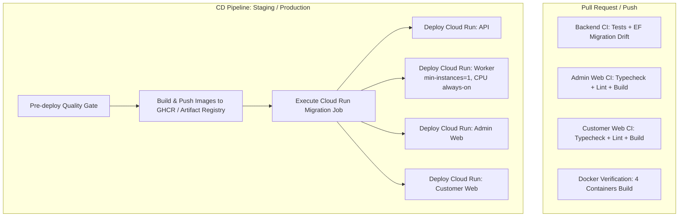

# Manoksha Collections — CI/CD & Deployment Guide

This document details the Continuous Integration (CI) and Continuous Delivery/Deployment (CD) pipeline configured in this repository.

---

## 1. Pipeline Overview



---

## 2. GitHub Actions Workflows

| Workflow | File | Triggers | Description |
|---|---|---|---|
| **Backend CI** | [backend.yml](file:///.github/workflows/backend.yml) | PR / Push touching `manoksha-backend/**` or `contracts/**` | Runs package vulnerability audit, unit tests, architecture tests, real PostgreSQL integration tests, and EF model change validation. |
| **Admin Web CI** | [admin-web.yml](file:///.github/workflows/admin-web.yml) | PR / Push touching `manoksha-admin-web/**` or `packages/**` | Validates OpenAPI types match committed contract, runs ESLint, TypeScript typecheck, and Next.js production build. |
| **Customer Web CI** | [customer-web.yml](file:///.github/workflows/customer-web.yml) | PR / Push touching `manoksha-customer-web/**` or `packages/**` | Validates OpenAPI types, ESLint, TypeScript typecheck, and Next.js production build. |
| **Docker Build Verification** | [docker-build-verify.yml](file:///.github/workflows/docker-build-verify.yml) | PR / Push | Builds all 4 container images with Buildx caching to ensure Dockerfiles never break unnoticed. |
| **Continuous Delivery (CD)** | [cd.yml](file:///.github/workflows/cd.yml) | Git release tag `v*.*.*` or manual `workflow_dispatch` | Executes quality gates, builds/pushes container images, runs database migration job, and deploys services to Cloud Run. |

---

## 3. Container Images & Build Targets

All container builds use multi-stage Dockerfiles with optimized layer caching:

1. **`manoksha-api`**:
   - Dockerfile: [manoksha-backend/Dockerfile](file:///Users/vamshinune/Projects/Manoksha%20Collections%20Backend/manoksha-backend/Dockerfile) (default `APP=Api`)
   - Purpose: Serves the ASP.NET Core Web API on port 8080 and executes operational commands (`migrate`, `bootstrap-owner`, `seed-dev`).
2. **`manoksha-worker`**:
   - Dockerfile: [manoksha-backend/Dockerfile](file:///Users/vamshinune/Projects/Manoksha%20Collections%20Backend/manoksha-backend/Dockerfile) (`--build-arg APP=Worker`)
   - Purpose: Background jobs (outbox dispatcher, 5-minute reservation cleanup, payment reconciliation, housekeeping). Deployed with `--min-instances=1` and `--no-cpu-throttling`.
3. **`manoksha-admin-web`**:
   - Dockerfile: [manoksha-admin-web/Dockerfile](file:///Users/vamshinune/Projects/Manoksha%20Collections%20Backend/manoksha-admin-web/Dockerfile)
   - Purpose: Next.js standalone server for Owner and staff portal.
4. **`manoksha-customer-web`**:
   - Dockerfile: [manoksha-customer-web/Dockerfile](file:///Users/vamshinune/Projects/Manoksha%20Collections%20Backend/manoksha-customer-web/Dockerfile)
   - Purpose: Next.js standalone storefront and reseller portal.

---

## 4. GitHub Secrets & Variables Configuration

To enable automated Cloud Run deployments, configure the following secrets in GitHub (**Settings → Secrets and variables → Actions**):

| Secret / Variable | Description | Example |
|---|---|---|
| `GCP_PROJECT_ID` | Google Cloud Project ID | `manoksha-prod` |
| `GCP_REGION` | Target GCP region | `asia-south1` |
| `GCP_WORKLOAD_IDENTITY_PROVIDER` | Workload Identity Pool Provider resource URI | `projects/123456789/locations/global/workloadIdentityPools/github-pool/providers/github-provider` |
| `GCP_SERVICE_ACCOUNT` | Service account with Cloud Run Admin & Artifact Registry Writer roles | `github-actions-deployer@manoksha-prod.iam.gserviceaccount.com` |

> [!NOTE]
> Container images are automatically pushed to **GitHub Container Registry (GHCR)** using the built-in `GITHUB_TOKEN` without requiring any extra credentials.

---

## 5. How to Deploy

### Automatic Deployment (Release Tag)
Pushing a semver tag automatically deploys to Production:
```bash
git tag v1.0.0
git push origin v1.0.0
```

### Manual Deployment (Workflow Dispatch)
1. Go to **Actions** → **cd-deploy** workflow in GitHub.
2. Click **Run workflow**.
3. Choose:
   - **Environment**: `staging` or `production`
   - **Run migrations**: `true` / `false`
   - **Services**: `all`, `backend-only`, or `frontend-only`
4. Click **Run workflow**.
